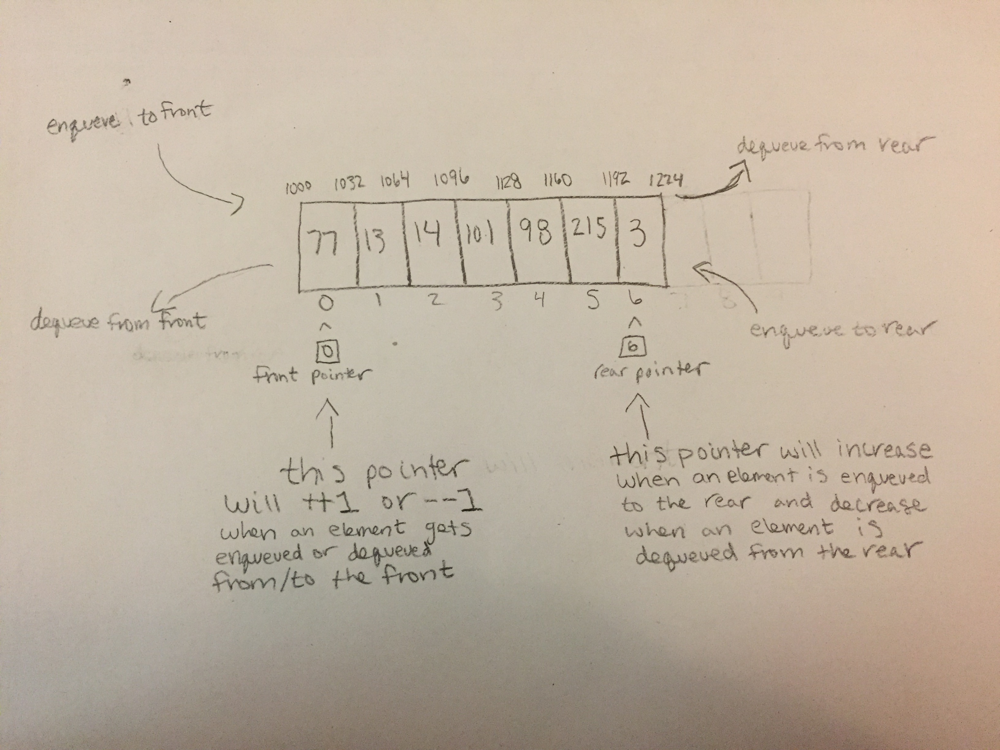

# Deque

A deque is a double ended queue. Meaning that it is a queue that can support items being enqueued to the front and rear. It can also support items being dequeued from the front and rear. It has the capabilities of a stack and queue but it is neither a LIFO or FIFO data structure.

# In Memory

In memory, a deque looks like this:



\[The two pointers will increase or decrease by one accordingly whenever an item is enqueued or dequeued from the the deque.\]

# Operations

A deque supports the following operations:

* **enqueueFront**: EnqueueFront enqueues an item to the front of the queue. This operation has a complexity of O(1) as long as we maintain a pointer to the front of the deque.
* **enqueueRear**: EnqueueRear enqueues an item to the reat of the queue. As with enqueueing from a normal queue, the complexity is O(1) as long as we maintain a pointer to the rear of the deque.
* **dequeueFront**: DequeueFront dequeues an item from the front of the queue with a complexity of O(1) just like dequeing from a normal queue this is possible with a pointer at the front of the queue.
* **dequeueRear**: DequeueRear dequeues an item from the rear of the deque. The complexity is also O(1) as long as we have that pointer at the end of the deque.

# Use Cases

A deque is useful in  many situations. An example would be a DutchBros. coffee stand with two drive up windows. Generally, cars will line up at one window. If this line gets too long, however, cars can enter (enqueue) from the other window going the opposite direction. If both sides have long lines and one side starts to get shorter, the last car in one line can move to the end of the shorter line. Cars can not move from one line to the other if they are in the middle (without causing a huge traffic jam).

A deque is not as useful when we want our data processed in the order it was recieved with no exceptions. This would require a queue.

# Example

```
myDeque = Deque() #instantiates an empty deque

myDeque.enqueueFront(7) #enqueues 7 to the front of the deque
myDeque.enqueueRear(13) #enqueues 13 to the rear of the deque
myDeque.enqueueFront(22) #enqueues 22 to the front of the deque
myDeque.dequeueFront() #dequeues 22 from the deque
myDeque.dequeueRear() #dequeues 13 from the deque
```

(c) 2018 Chevelle Boyer. All rights reserved.