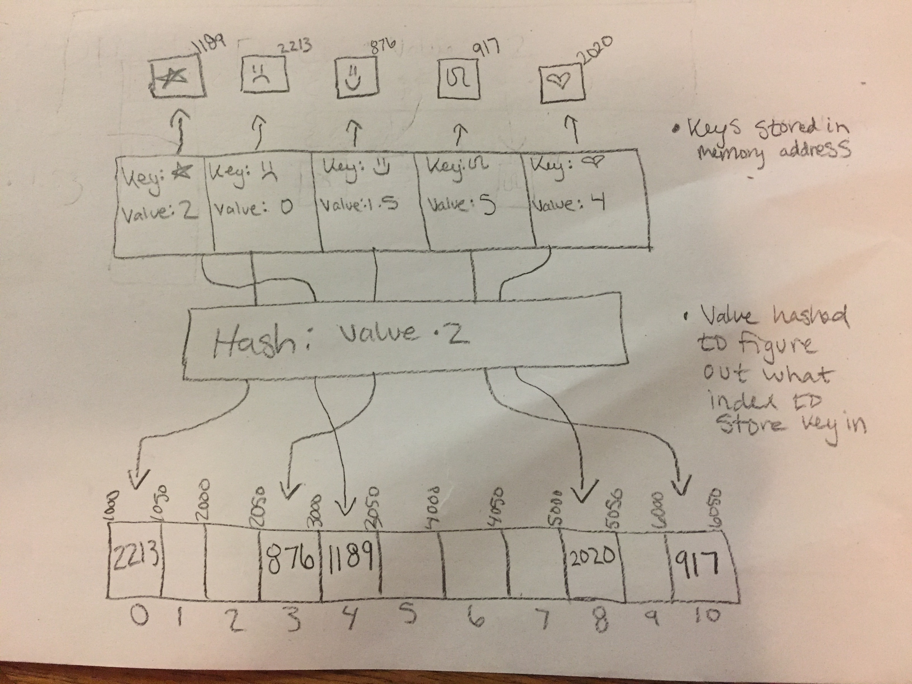

# Dictionary

A dictionary is an unordered structure that is a collection of pairs of items where each pair consists of a key and a value. We are able to access a value via its key. We use hashing to determine where to place the key in a dictionary.

# In Memory

In memory, a dictionary looks like this:



\[There are a few ways to implement a dictionary. This drawing in memory is based off of an array implementation.\]

# Operations

A dictionary supports the following operations:

* **in**: Checking to see if a key is in the dictionary. This complexity is O(1) because we hash the value which is just one calculation. The hash result will tell us where in the array to store the memory address of the key. So if we hash the value of the item we wish to search for and we find something in that index we know it is in the dictionary.
* **containsValue**: Checking to see if a value is in a dictionary. The complexity of this operation is O(n) because we have to iterate through all keys.
* **add(key, value)**: Adding a key value pair to a dictionary is O(1) complexity becuase it just takes one calculation to perform the hash function to get the index to place the key. If we have to make our hastable larger then this operation becomes O(n)
* **del**: Deleting a key from a dictionary is an O(1) operation becasue we can find the index it is stored via a hash function and then remove it. Since the index of each item is based on the hash function of its value we do not need to shift values over after deleting or inserting a key.

# Use Cases

A dictionary is useful when we want to keep track of values associated with a particular key. For example if we wanted to store test scores, we could create a test scores dictionary and store students names as the key and their test scores as the values.

A dictionary is not as useful when there is not a natural key-value association. Nor would they be as useful when it requires a lot of searching on the values (rather than the keys).

# Example

```
testScore = {} #creates an empty dictionary

testScore['Kevin'] = 98 #adds a key value pair of {'Kevin': 98} to the dictionary
testScore['Darrin'] = 89 #adds a key value pair of {'Darrin': 89} to the dictionary
testScore['Kim'] = 78 #adds a key value pair of {'Kim': 78} to the dictionary
'kim' in testScore #returns true if 'kim' is a key in the dictionary
del testScore['Kim'] #deletes the key value pair with key 'kim'
```

(c) 2018 Chevelle Boyer. All rights reserved.
