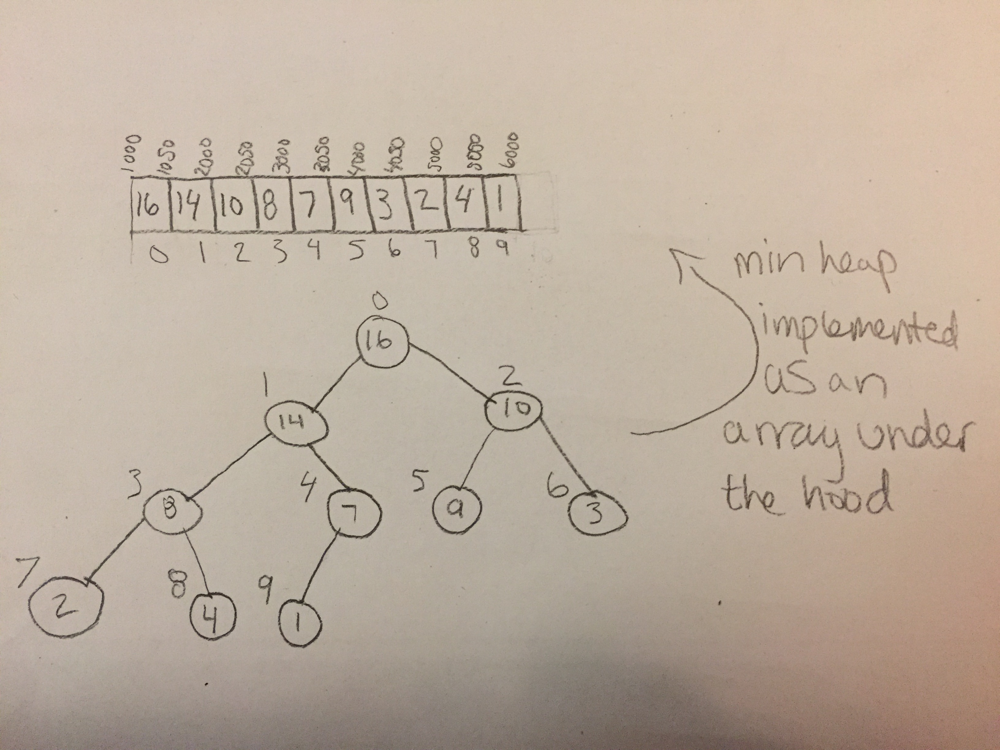

# Priority Queue

A priority queue is like a queue, but items have priorty which determines their order in the queue. When we enqueue an item it could be moved all the way to the front, or somewhere in the middle depending on it's given priority. We still only dequeue from the front. We implement a priority queue using a binary heap. There are two types of binary heaps, a min heap and a max heap. A min heap always stores the smallest key at the front. A max heap always stores the largest key at the front.

# In Memory

In memory, a priority queue looks like this:




# Operations

A priority queue supports the following operations:

* **enqueue**: Enqueueing an item from a priority queue has a complexity of O(log(n)) becasue it is implemented using a min heap, which acts like a tree and trees are O(log(n))
* **dequeue**: Dequeueing an item from a priority queue also has a complexity of O(log(n)) for the same reasons.

# Use Cases

A priority queue is useful in situations like the order in which emergency rooms see patients. For the most part ER's operate on a first come first served (FIFO) basis. But if someone comes in with a gunshot wound, that has a higher priority and needs to be seen sooner than someone with a sprang ankle.

A priority queue is not as useful when we want to process our data in a FIFO fashion with no exceptions.

# Example

```
myPriorityQueue = PriorityQueue()

myPriQue.enqueue(17) #enqueues 17 based on priority
myPriQue.enqueue(22) #enqueues 22 based on priority
myPriQue.dequeue() #dequeues 17 assuming it had higher priority
```

(c) 2018 Chevelle Boyer. All rights reserved.