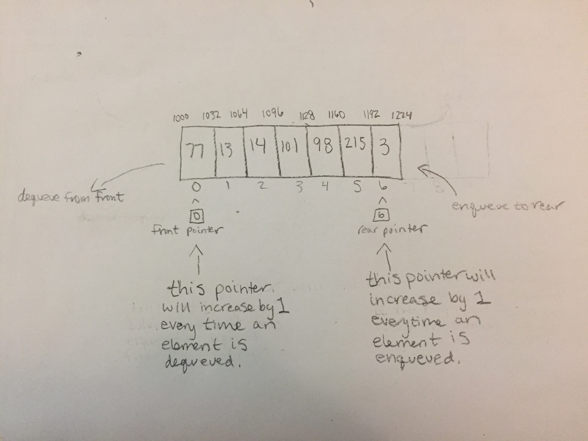

# Queue

A queue is a linear data structure but it is not a contiguous block of memory. It can be thought of as an ordered collection of items. It is a FIFO data structure meaning its nature is first in first out. This can be thought of as "first come first served."

# In Memory

In memory, a queue looks like this:



\[description of diagram\]

# Operations

A queue supports the following operations:

* **dequeue**: Dequeueing the first item from the queue. This operation has a complexity of O(1) because in the implementation we maintain a pointer to the first variable in the array or linked list (however we choose to implement it) to allow for constant time.
* **enqueue**: Enqueueing an item to the end of the queue. The complexity of this operation is also O(1) because we only ever enqueue to the end of the list. Whether we implement the queue using an array or a linked list this operation can be made O(1) by maintaing a pointer at the end of the array or linked list.

# Use Cases

A queue is useful when we need things to be processed in the order of which they come. An example of this would be a printer in the home. More than likely there is only one printer but many devices connected to it. The printer can print documents from all of them by printing in the order that they were sent to it.

A queue is not as useful when we need to insert or delete items from the middle of the queue because that is not the behavior of a queue. Likewise, if we need data to be processed in an order differnt from FIFO, the queue is not the structure we are looking for.

# Example

```
myQueue = Queue() #instantiates a Queue

myQueue.enqueue(5) #enqueues 5 to the end of the queue
myQueue.enqueue(18) #enqueues 18 to the end of the queue
myQueue.enqueue(3) #enqueues 3 to the end of the queue
myQueue.dequeue() #dequeues 5 from the queue
```

(c) 2018 Chevelle Boyer. All rights reserved.