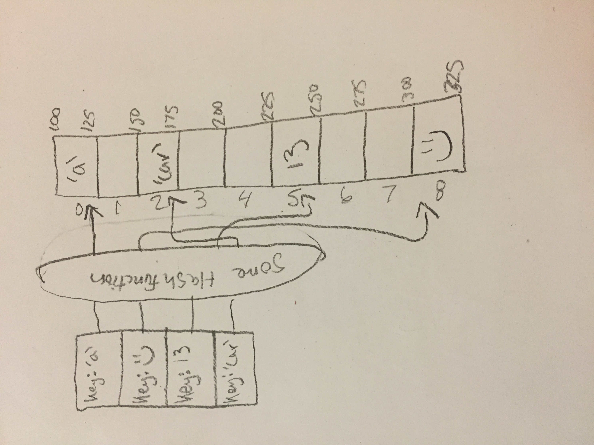

# Set

A set is an unordered collection of data objects similar to dictionaries but with only keys. Sets do not allow duplicates. Because of these behaviors a set guarentees everything is unique. Sets are also heterogeneous, meaning they aren't limited to a single data type such as ints.

# In Memory

In memory, a set looks like this:




# Operations

A set supports the following operations:

* **containsKey**: ContainsKey checks to see if a key is in a set. The complexity is O(1).
* **add**: This operation will add an element into the set. Its complexity is O(1) because like a dictionary it is also implemented using a hash table which allows for constant time operations.
* **remove**: Remove will remove a key from the set. The complexity is also O(1).

# Use Cases

A set is useful when we have a lot of data that has no real order. An example of when a set could be useful would be reading recipes. Upon first glance of the cook book you see 1/2 cup of butter is required for the filling so you take it out to thaw and continue. Once the filling is made you move on to the crust and see another 1/2 cup of butter is required for the crust so you are stuck waiting for ANOTHER 1/2 cup of butter to thaw. This ordeal could have been avoided if all the ingridients were in a set. Since sets do not allow for duplicates we would have seen upon first glance that we needed to thaw a total of 1 cup of butter.

# Example

```
mySet = {12, TRUE, 'cat', 77, 0} #Creates a set with values 12, TRUE 'cat', 77, 0

'dog' in mySet #returns false because 'dog' is not a key in mySet
mySet.add('dog') #adds 'dog' to mySet
mySet.remove('cat') #removes 'cat' from mySet
```

(c) 2018 Chevelle Boyer. All rights reserved.
