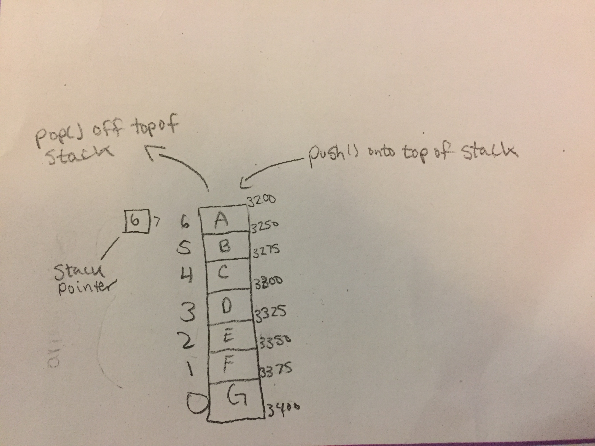

# Stack

A stack is a linear data structure that is LIFO in nature. When using a stack you push items into it. If you ever want to use those items, you can only take them off from the top.

# In Memory

In memory, a stack looks like this:



# Operations

A stack supports the following operations:

* **push**: Pushes an element onto the top of the stack. This operation is O(1) because we maintain a stack pointer that keeps track of where the top of the stack is at all times. Every time we wish to push an item, we just push to the memory address of the current top. No other elements are shifting or moving becuase the new item always goes to the top most position.
* **pop**: This operation will pop (which is like a deletion) the top item off of the stack. It is also an O(1) operation. Due to the stack pointer there is no indexing taking place to find the item we wish to pop, we know exactly where it is in memory allowing for a singly operation. 
* **peek**: Peek allows us to view the value of the top item on the stack. It is an O(1) operation because of the stack pointer which always points to the top item.

# Use Cases

A stack is useful when we want something in reverse order due to the nature of LIFO. For example when the use of backtracking is required. Another example might be when reversing something. For example: If we pushed the letters of "apple" in a stack, popping them off would result in "elppa".

A stack is not as useful when we need to access/insert/delete items in the middle of our data or altering the data currently stored. Nor is it as useful when we need to maintain the exact order because the nature of the stack will cause the order to be reversed.

# Example

```
pancake = Stack() #instantiates an empty stack

pancake.push(blueberry) #pushes a blueberry pancake object onto the top of the stack
pancake.push(bananaCream) #pushes a bananaCream pancake object onto top of stack
pancake.push(chocolateChip) #pushes a chocolateChip pancake object onto top of stack
pancake.pop() #removes chocolateChip pancake object from top of stack
```

(c) 2018 Chevelle Boyer. All rights reserved.
