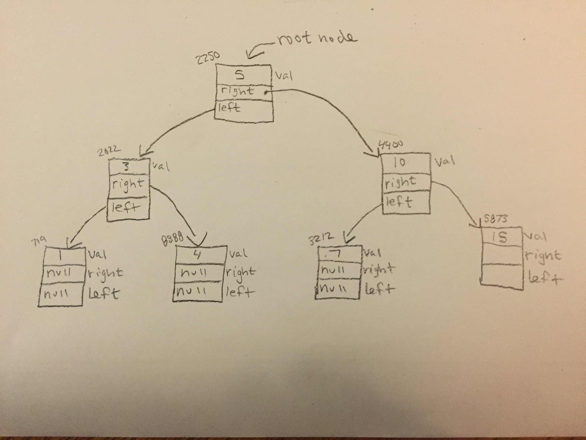

# Tree

A tree is a non-linear data structure. It consists of nodes, edges which connect the nodes, and a root. The root is the very top node in the tree. There are many different types of trees. A binary tree, each node can have at most two children. A Binary Search Tree. Like a binary tree each node can have atmost two children. Any node in a bst must be greater than the values to the left of it, and less than any values to the right of it. Binary Search Trees are divide and conquer structures. They typically have 4 pointers, one to their place in memory, another to their parent, and two more pointing to their left and right children.

# In Memory

In memory, a binary search tree looks like this:



\[description of diagram\]

# Operations

A binary search tree supports the following operations:

* **search**: Searching for a node in a binary tree has a complexity of O(log(n)) because we are cutting the amount of data that needs to be searched in half each time. If we are looking for 15, and our root is 20, we can eliminate everything to the right of the node with value 20.
* **insert**: Inserting a new node into a binary search tree is also O(log(n)) because we are eliminating half of the data each time. If we want to insert 32 and the root node is 10, we know we can eliminate all the data on the left side of the root.
* **delete**: The complexity of deleting a node is O(log(n)) too, for the same reasons as insert and search.
* It is worth mentiong the three tree traversals. Preorder, Inorder, Postorder. **Preorder**: Recursivley searches the root first, then left, then right. **Inorder**: Recursivley searches the left node, then root, then right. **Postorder**: Recursivley searches the left node, then right, then root.
* It is also important to note that these are only average complexities. See below under Use Cases.


# Use Cases

A Binary search tree is useful in search applications when there is constantly data coming in and out.

A Binary search tree is not as useful when the data we have coming in is not in random order. This is because a bst can quickly turn into a linked list if all the values are greater than (or less than) the first value inserted. This is an unbalanced tree and the complexities for all operations become O(n)

# Example

```
bst = BinarySearchTree(50) #instantiates a BinarySearchTree object with value 50

bst.insert(25) #inserts 25 to the left of 50
bst.insert(75) #inserts 75 to the right of 50
bst.delete(25) #deletes node with value 25
```

(c) 2018 Chevelle Boyer. All rights reserved.