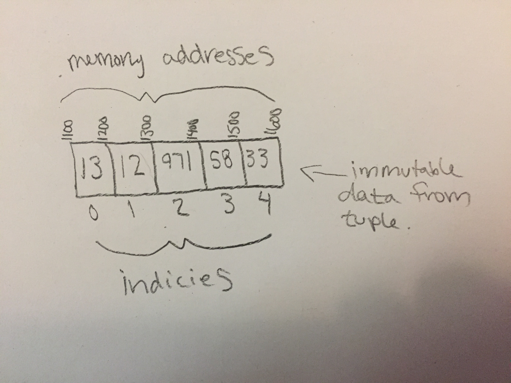

# Tuple

A tuple is a linear data structure similar to an array. One of the differences between them is that a tuple is immutable and therefore can't be changed. Tuples are heterogenous meaning they can store multiple data types. The elements in a tuple are just references to strings which is why they cannot be changed/modified. You can, however, modify the object it points to.

# In Memory

In memory, a tuple looks like this:




# Operations

A tuple supports the following operations:

* **access**: Accessing an element in the tuple has a complexity of O(1) if done with the index, and O(n) if the index is not known. This is because just like with an array the tuple variable points to the memory base address. From there we can do one calculation, base address + index, to access any element. This is the only operation supported by a tuple because it is immutable. Since it cannot be changed we cannot insert or delete elements.

# Use Cases

A tuple is useful when we have data that will not be changed and we need fast access. Likewise, if we do not want our data to be altered a tuple is useful.

A tuple is not useful when we will need to alter our data such as making insertions/deletions.

# Example

```
myTuple = (13, 7, TRUE, 99, 'star')

myTuple[0] #returns 13
myTuple[4] #returns 'star'
```

(c) 2018 Chevelle Boyer. All rights reserved.
